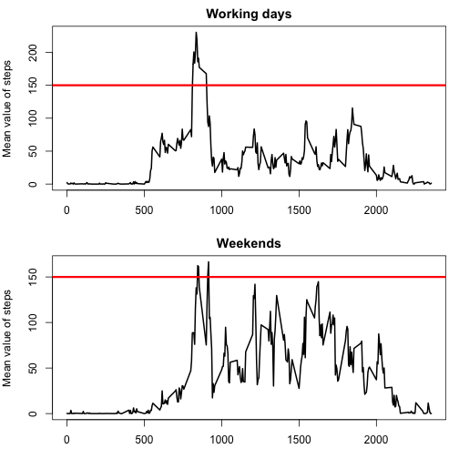

# Reproducible Research: Peer Assessment 1


## Loading and preprocessing the data


```r
library("data.table")
setwd("~/Dropbox/Git/RepData_PeerAssessment1")
data1 <- data.table(read.csv("activity.csv"))
```


## What is mean total number of steps taken per day?


```r
# observations with NA are not interesting for us yet
data <- data1[!is.na(data1$steps),]
# find sums of steps by every day using "data.table" package magic.
sums <- data[,sum(steps, na.rm = T), by = date]$V1
# plot the hist and find mean and median values
hist(x = sums, xlab = "Sum of steps", breaks = 30, main = "Sums of steps")
```

 

```r
mean_value <- mean(sums)
median_value <- median(sums)
```

Histogram represents the distribution of number of steps by dates. Observations with NA are excluded. On average, 1.0766 &times; 10<sup>4</sup> steps are done every day. The median value is 10765.


## What is the average daily activity pattern?

```r
# find mean steps by evey interval
meansInIntervals <- data[,mean(steps, na.rm = T), by = interval]$V1
plot( x = unique(data$interval) ,y = meansInIntervals, "l", xlab = "Interval",
      ylab = "Mean value of steps", lwd = 2 )
```

 

```r
# find maximum interval. which.max function finds an index of the maximun value
unique(data$interval)[which.max(meansInIntervals)]
```

```
## [1] 835
```

As one can see from the graph, the peek of walking activity is in the morning. On average, people walk the most in 8:35.


## Imputing missing values

```r
naToMean <- function(x){
    x <- data.frame(x)
    x[is.na(x$steps),1] <- mean(x$steps, na.rm = T)
    x <- data.table(x)
    x
}

b <- lapply( split(data1, factor(data1$interval)) , naToMean         )
dataWithoutNA <- do.call(rbind.data.frame, b)
sums <- dataWithoutNA[,sum(steps, na.rm = T), by = date]$V1
hist(x = sums, xlab = "Sum of steps", breaks = 30, main = "Sums of steps")
```

 

```r
mean_value <- mean(sums)
median_value <- median(sums)
```

After imputing NAs with means (interval means), the shape of the distribution hasn't changed dramatically. On average, 1.0766 &times; 10<sup>4</sup> steps are done every day and the median value is 1.0766 &times; 10<sup>4</sup>. The values are practically the same as they used to be. 


## Are there differences in activity patterns between weekdays and weekends?


```r
isItWeekend <- function(x){
    if(weekdays(x) == "воскресенье") return(1)
    else if(weekdays(x) == "суббота") return(1)
    else return(0)
}
isItWeekend <- Vectorize(isItWeekend)
weekdays <- isItWeekend(as.Date(dataWithoutNA$date))
dataWithoutNA <-  dataWithoutNA[,isWeekend := weekdays]
par(mfrow = c(2,1), mar = c(3,4,2,1))
meansInIntervals <- dataWithoutNA[weekdays == 0,mean(steps, na.rm = T), by = interval]$V1
plot( x = unique(dataWithoutNA$interval) ,y = meansInIntervals, "l", 
      xlab = "Interval", ylab = "Mean value of steps", lwd = 2, main = "Working days" )
abline(h = 150, col = "red", lwd = 3)
meansInIntervals <- dataWithoutNA[weekdays == 1,mean(steps, na.rm = T), by = interval]$V1
plot( x = unique(dataWithoutNA$interval) ,y = meansInIntervals, "l", 
      xlab = "Interval", ylab = "Mean value of steps", lwd = 2 , main = "Weekends")
abline(h = 150, col = "red", lwd = 3)
```

 

As one can see from the graphs, people tend to walk more in weekends. However, people are a bit less active in the weekends' mornings!
